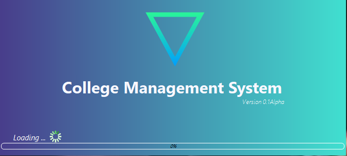
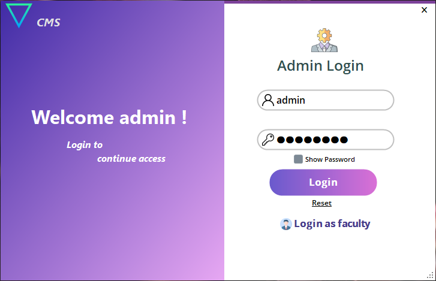
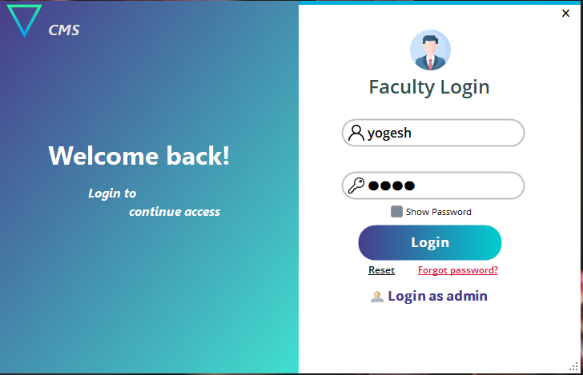
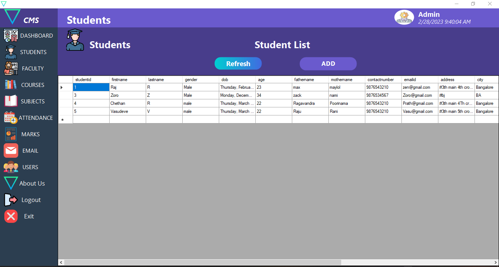
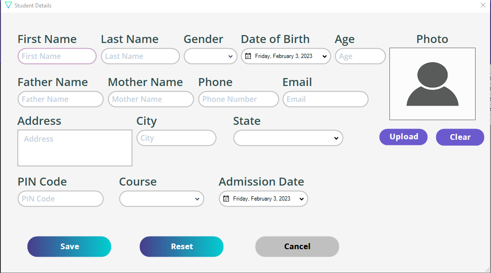
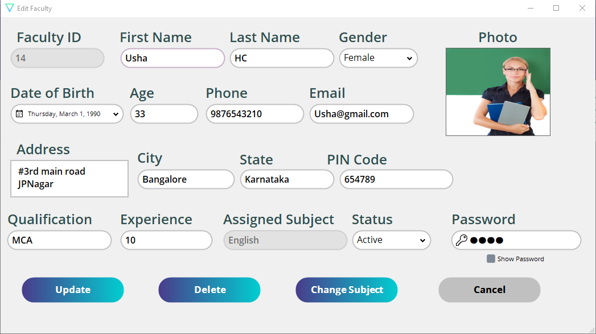
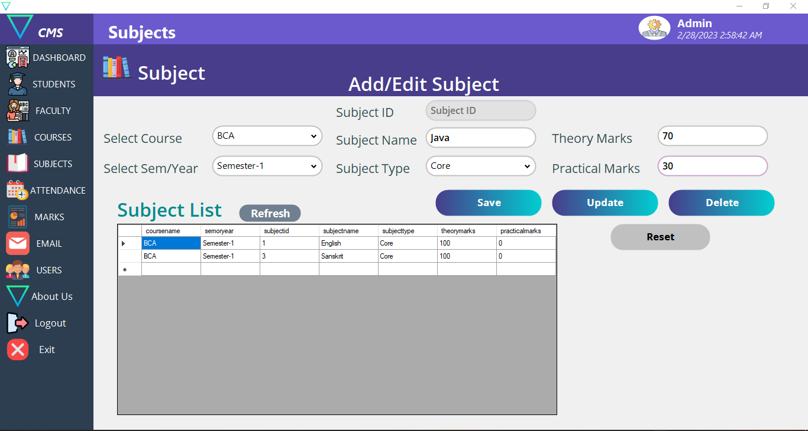
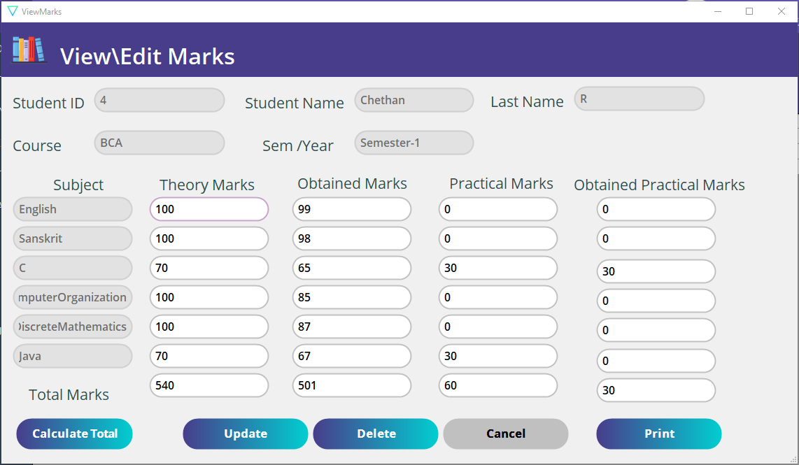

## College Management System in VB.NET

A Desktop Application for managing a `college` data. It's developed using `VB.Net` programming language & `MySQL` database.


### Requirements

- git
- Visual Studio 2023
- MySQL Workbench

#### Download and setup

- Clone the repo

  **For Windows run below commands before cloning the Repo.**

  ```
  $ git clone https://github.com/y0geshx/Collage-Management-System.git 

  ```
  - Open Collage-Management-System folder in visual studio and run CMS_Project.sln

### Database setup

- Import cmsdb.sql database in Mysql Workbench
- Change MySqlConnection `` Collage-Management-System/CMS_Project/DTconnection/DTconnection.vb ``


## Snapshots


















#### [More snapshots](snapshots/)

### Issues
- If you have trouble setup please a open issue.
- Contact me via email or discord.
